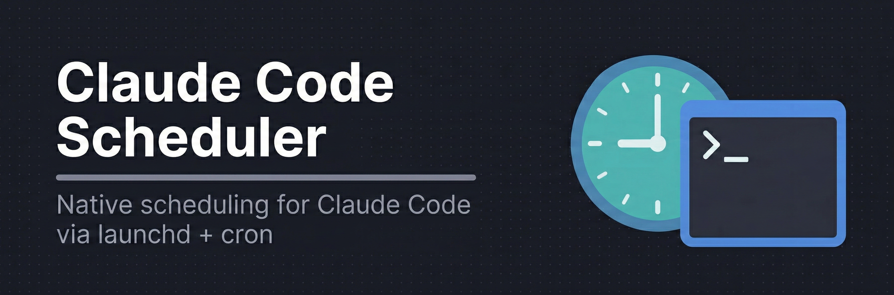
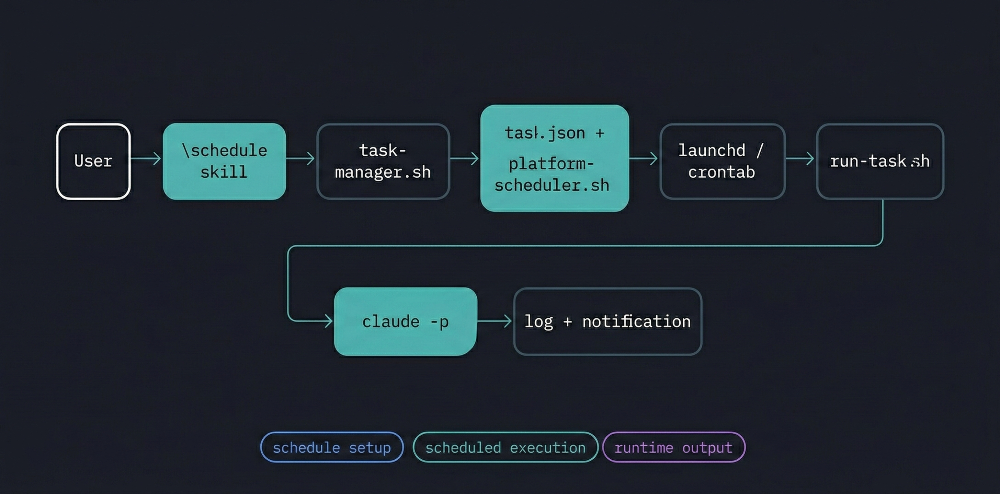

<p align="center">
  
</p>

# Claude Code Scheduler

Schedule Claude Code tasks to run automatically. Shell and Python 3 only -- no other dependencies.

[David Diviny pointed out](https://x.com/daviddiviny/status/2028210513038180550) that Claude Cowork has scheduling but no CLI access, while Claude Code has CLI access but no scheduling. This plugin adds scheduling to Claude Code.

## Install

```
/plugin marketplace add intertwine/claude-code-scheduler
/plugin install scheduler@claude-code-scheduler
```

## Uninstall

```
/plugin uninstall scheduler
/plugin marketplace remove claude-code-scheduler
rm -rf ~/.claude-scheduler  # optional: remove task data and logs
```

## Usage

```
/schedule Review my code for security issues every weekday at 9am
/schedule List my scheduled tasks
/schedule Run the security review task now
/schedule Pause the security review
/schedule Remove the security review task
/schedule Show me the logs for the security review
```

Cron expressions work too:

```
/schedule Add a task with cron "*/30 9-17 * * 1-5" to check for TODO comments in this project
```

## How it works

<p align="center">
  
</p>

1. You describe what to schedule and when
2. Claude creates a task definition and registers it with your OS scheduler
3. At the scheduled time, launchd (macOS) or cron (Linux) runs the task
4. The task runs `claude -p` with your prompt and tool configuration
5. Output gets logged and you get a desktop notification

## Requirements

- Claude Code v1.0.33+
- macOS or Linux
- Python 3 (ships with macOS and most Linux distros)
- `claude` CLI in your PATH

## File structure

```
claude-code-scheduler/
├── .claude-plugin/plugin.json       # Plugin metadata
├── skills/schedule/
│   ├── SKILL.md                     # Skill instructions
│   └── CRON_REFERENCE.md            # Cron syntax reference
└── scripts/
    ├── task-manager.sh              # Task CRUD
    ├── platform-scheduler.sh        # launchd/crontab management
    ├── run-task.sh                  # Execution wrapper
    └── notify.sh                    # Desktop notifications
```

## Data storage

Everything goes in `~/.claude-scheduler/`:

```
~/.claude-scheduler/
├── tasks/          # Task definition JSON files
│   └── a1b2c3d4.json
└── logs/           # Per-task execution logs
    └── a1b2c3d4/
        ├── 20260301_090000.log
        └── latest -> 20260301_090000.log
```

## Task configuration

| Field | Default | Description |
|-------|---------|-------------|
| `name` | (required) | Task name |
| `schedule` | (required) | 5-field cron expression |
| `prompt` | (required) | What Claude should do |
| `working_directory` | Current dir | Where the task runs |
| `allowed_tools` | `Read,Grep,Glob` | Tools available during execution |
| `max_turns` | `10` | Max agentic turns per run |
| `notify` | `true` | Desktop notification on completion |

## Troubleshooting

**Task not running?**

```bash
# macOS: check if registered
launchctl list | grep claude-scheduler

# Linux:
crontab -l | grep claude-scheduler
```

**Check logs:**

```bash
cat ~/.claude-scheduler/logs/<task-id>/latest
```

**`claude` not found during scheduled execution?**

The run script sets a broad PATH, but if `claude` is installed somewhere unusual, find it with `which claude` and make sure that location is in the script's PATH or your shell profile.

**macOS: task didn't run after sleep?**

launchd runs missed jobs after wake. Verify the plist is loaded:

```bash
launchctl list | grep claude-scheduler
```

## Comparison

| | This plugin | [jshchnz/claude-code-scheduler](https://github.com/jshchnz/claude-code-scheduler) | [kylemclaren/claude-tasks](https://github.com/kylemclaren/claude-tasks) |
|---|---|---|---|
| Dependencies | Shell + Python 3 | Node.js + TypeScript | Go |
| Files | 9 | 30+ | 20+ |
| Install | One command | One command | Binary download |
| Windows | No | Yes | Yes |
| Approach | Shell scripts | TypeScript | Go TUI |

This plugin is 9 files with no build step. You can read every line of it.

## License

MIT
